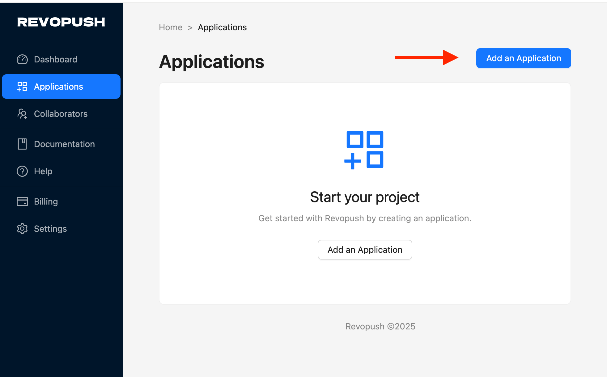
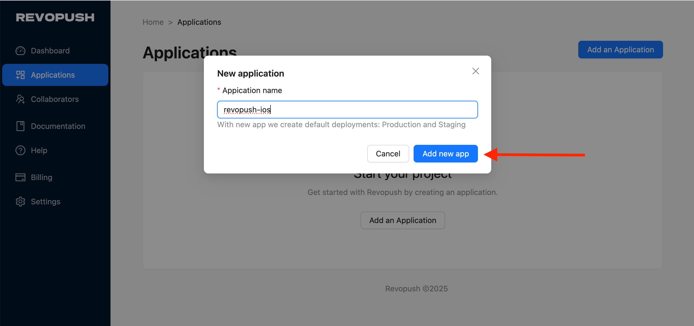
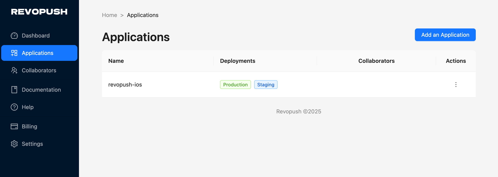
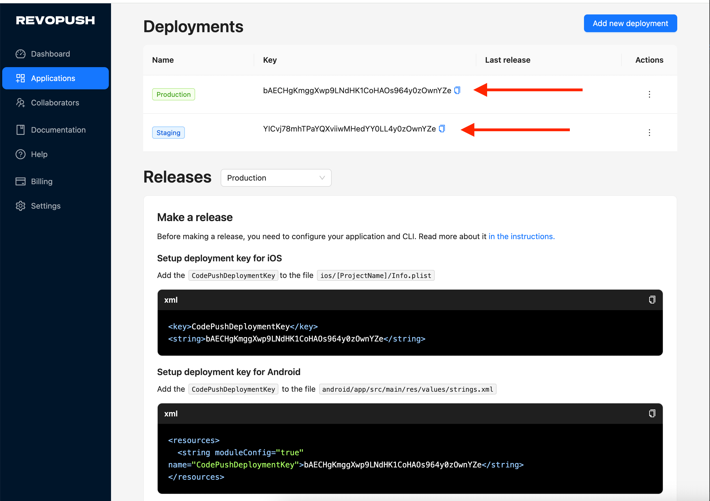

# Getting started

This 5-minute guide will help you to set up your first Revopush integration

## Create an account

First, you need to create an account at the following service: https://app.revopush.org/register

## Create application

1. Go to Applications and create new application



2. Enter application name and save it



3. As a result, you will see your application in the list with two deployments




## Setup mobile client SDK

First, you need to decide what client to use. We support two options.

If you use React Native up to 0.76 and old architecture, you should stay on a Microsoft CodePUsh client SDK. 
[Read here](https://github.com/microsoft/react-native-code-push) how to configure Microsoft CodePUsh SDK.

If you need React Native > 0.76, or you need support for New Architecture, you can choose our client SDK. 
[Read here](https://github.com/revopush/react-native-code-push) how to configure Revopush SDK.

| React Native version(s) | Supporting CodePush version(s)                                                           |             
|-----------------------|------------------------------------------------------------------------------------------|
| <v0.76                | Use old Microsoft [CodePush client](https://github.com/microsoft/react-native-code-push) |
| v0.76, v0.77, 0.78    | Use [Revopush SDK](https://github.com/revopush/react-native-code-push) (Support both New and Old Architectures)                                                                             |

After you configure your React Native application got to app settings to get Deployment keys:



### Setup deployment key for iOS

Add the `CodePushServerURL` and `CodePushDeploymentKey` to the file `ios/[ProjectName]/Info.plist` 

```xml
<key>CodePushServerURL</key>
<string>https://api.revopush.org</string>
```

```xml
<key>CodePushDeploymentKey</key>
<string>YOUR_DEPLOYMENT_KEY</string>
```

### Setup deployment key for Android

Add the `CodePushServerUrl` and `CodePushDeploymentKey` to the file `android/app/src/main/res/values/strings.xml`

```xml
<resources>
    <string moduleConfig="true" name="CodePushServerUrl">https://api.revopush.org</string>
</resources>
```

```xml
<resources>
    <string moduleConfig="true" name="CodePushDeploymentKey">YOUR_DEPLOYMENT_KEY</string>
</resources>
```

## Configure CLI

After registration, install the Revopush CLI.

```shell
npm install -g @revopush/code-push-cli
```

Login to Revopush CLI using the following command:

```shell
revopush login
```

This will launch a browser, asking you to authenticate with either your GitHub or Google account.
This will generate an access key that you need to copy/paste into the CLI (it will prompt you for it).
You are now successfully authenticated and can safely close your browser window.

```shell
Opening your browser...
Visit https://app.revopush.org/cli-login?hostname=<YOUR_HOST_NAME> and enter the code

Enter your access key:
```

Read more about [Revopush CLI](/cli/getting-started)

## Make release

In the root folder of a React Native project, run these commands

```shell
revopush release-react <APPLICATION_NAME> ios -d <DEPLOYMENT_NAME>
```

```shell
revopush release-react <APPLICATION_NAME> android -d <DEPLOYMENT_NAME>
```

Read more about Releases in [Releasing updates guide](/cli/releasing-updates)

## App center Migration

If you migrate your applications from App center follow our [step-by-step guide](/migration/guide).
